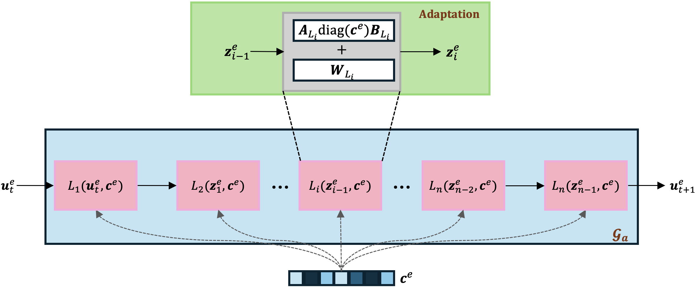

# GEPS: Boosting Generalization in Parametric PDE Neural Solvers through Adaptive Conditioning
Official PyTorch implementation of GEPS 

<p float="center">
  
</p>

# 1. Code installation and setup
## pdegen installation
```
conda create -n geps python=3.11.0
pip install -e .
```

## setup wandb config example

add to your `~/.bashrc`
```
export WANDB_API_TOKEN=your_key
export WANDB_DIR=your_dir
export WANDB_CACHE_DIR=your_cache_dir
export WANDB_CONFIG_DIR="${WANDB_DIR}config/wandb"
export MINICONDA_PATH=your_anaconda_path
```

# 2. Data

We report in datasets the solvers used to generate the different datasets.

For the combined equation, we used the same solver than in https://github.com/brandstetter-johannes/LPSDA

# 3. Run experiments 

The code runs only on GPU. We provide sbatch configuration files to run the training scripts. They are located in `bash`. There is two different different files that must be runned:
* First, we run train.py to report in-domain performance. The weights of the model are automatically saved under its `run_name`.
* Second, we run the pre-trained model on new environments with adapt.py. 

We use the previous `run_name` as argument in the sbatch to load the model. The `run_name` is generated randomly by default with wandb. We provide examples of the python scripts that need to be run in each bash folder.

To cite our work:

```
@article{kassai2024geps,
  title={GEPS: Boosting Generalization in Parametric PDE Neural Solvers through Adaptive Conditioning},
  author={Kassaï Koupaï, Armand and Misfut Benet, Jorge and Vittaut, Jean-No{\"e}l and Gallinari, Patrick},
  journal={38th Conference on Neural Information Processing Systems (NeurIPS 2024)},
  year={2024}
}
```
